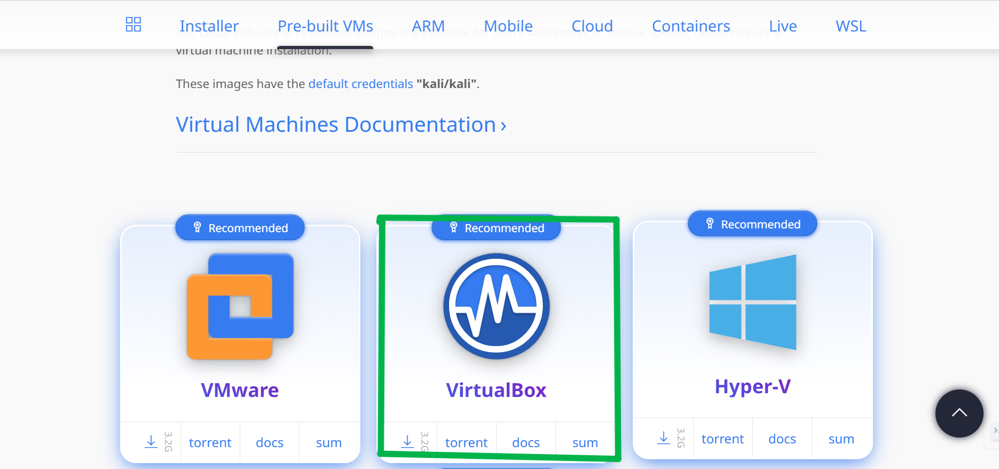
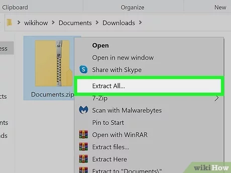

# Kali-Linux-Virtual-Box

## Step-by-Step Guide on Kali Linux Virtual Machine

In this guide, I’ll walk you through downloading and installing Kali Linux on VirtualBox. Kali Linux is a powerful penetration testing platform, and setting it up virtually allows you to practice ethical hacking and cybersecurity safely. Let’s get started with the step-by-step instructions!

### Step 1: Download Kali Linux ISO
Click [here](https://www.kali.org/get-kali/) to visit the Official Kali website and download the latest version of Kali Linux ISO suitable for your system (32-bit or 64-bit). Generally, you'll want the 64-bit version if your system supports it.

Extract the downloaded file using a reliable extraction tool like **WinRAR** or **7-Zip**. Ensure the files are extracted to a designated folder for easy access during the installation process.

### Step 2: Create a New Virtual Machine
By now, you should have VirtualBox downloaded and installed. If not, check out my guide linked [here](#) for assistance. Open VirtualBox, then click on the **"New"** button to proceed.

#### Name and Operating System
Name your virtual machine (e.g., "Kali Linux"), choose **"Linux"** as the Type, and select **"Ubuntu (64-bit)"** as the Version if using the 64-bit ISO.

#### Step 2 con’t: Memory Size
Allocate a minimum of **4096 MB** of memory for your virtual machine; however, **8192 MB (8 GB)** or more is recommended for better performance. For the processor, assign at least **4 CPUs** if available.

### Step 3: Create a Virtual Hard Disk
Allocate at least **20 GB** of storage for Kali Linux, though you can choose a larger size if you have sufficient disk space.

### Step 4: Configure VM Settings
Choose your virtual machine and click **"Settings"**. Navigate to the **"Storage"** section, then click the empty CD icon under **"Controller: IDE"**. Next, select **"Choose a disk file..."** and locate the Kali Linux ISO file you previously downloaded. This process attaches the ISO to your virtual machine for installation.

### Step 5: Configure the Network
Make sure your network settings are properly configured. It is recommended to use the **Bridged Adapter** setting, which allows your virtual machine to function as a separate device on your physical network. 

The VM will receive its own unique IP address either dynamically from the network’s DHCP server or through manual static configuration. This setup enables the virtual machine to interact seamlessly with other devices on your network, just like a physical computer. The **Bridged Adapter** option ensures better connectivity and access to network resources, making it ideal for scenarios that require full network integration for testing or communication purposes.

### Step 6: Start the VM
Click **"Start"** to boot the VM. Once booted, log in using the default credentials:  
- **Username**: `kali`  
- **Password**: `kali`

### Step 7: Update Kali
1. Launch a terminal and execute the command:  
   sudo apt update
 
   This ensures your system's package list is updated with the latest repositories.

3. Once the update is complete, run the command:  
   sudo apt upgrade -y
  
   This upgrades your Linux system to the latest available packages and enhancements.

### Notes
- **Download the Correct ISO**: Ensure you download the appropriate 64-bit or 32-bit ISO file from the [official Kali Linux website](https://www.kali.org/get-kali/).
- **Virtualization Software**: Install **VirtualBox** or **VMware** for a virtual setup.
- **Allocate Resources**:
  - Provide sufficient **RAM (4GB or more)** and **disk space (20GB minimum)**.
- **Network Settings**: Use the **Bridged Adapter** for seamless network connectivity.
